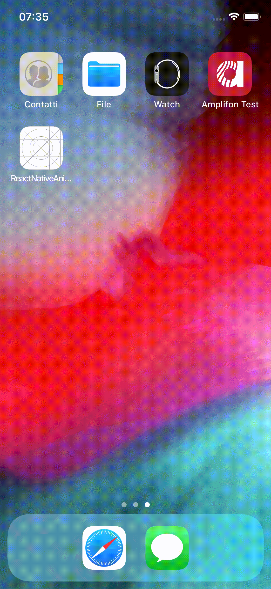

# ReactNativeAnimationIssue

## Intro

This is a sample project to reproduce _react-native_ issue [#26216](https://github.com/facebook/react-native/issues/26216).

## Title

iOS: Image X-axis rotation animation is not working

## Bug description

<!--
  Please provide a clear and concise description of what the bug is.
  Include screenshots if needed.
  Please test using the latest React Native release to make sure your issue has not already been fixed: http://facebook.github.io/react-native/docs/upgrading.html
-->

If you pass an `Animated.AnimatedInterpolation` value to `rotateX` property, it won't animate on iOS, but it will animate on Android.

**React Native version:**
<!--
  Run `react-native info` in your terminal and copy the results here.
-->
```
System:
    OS: macOS 10.14.6
    CPU: (8) x64 Intel(R) Core(TM) i7-4770HQ CPU @ 2.20GHz
    Memory: 170.50 MB / 16.00 GB
    Shell: 3.2.57 - /bin/bash
  Binaries:
    Node: 10.15.3 - /usr/local/bin/node
    Yarn: 1.17.3 - ~/.yarn/bin/yarn
    npm: 6.4.1 - /usr/local/bin/npm
    Watchman: 4.9.0 - /usr/local/bin/watchman
  SDKs:
    iOS SDK:
      Platforms: iOS 12.1, macOS 10.14, tvOS 12.1, watchOS 5.1
    Android SDK:
      API Levels: 23, 26, 28
      Build Tools: 21.1.2, 26.0.2, 28.0.3
      System Images: android-28 | Google Play Intel x86 Atom
  IDEs:
    Android Studio: 3.4 AI-183.5429.30.34.5452501
    Xcode: 10.1/10B61 - /usr/bin/xcodebuild
  npmPackages:
    react: 16.8.6 => 16.8.6 
    react-native: 0.60.5 => 0.60.5
```

## Steps To Reproduce

1. Init: `react-native init ReactNativeAnimationIssue`
2. Replace `App.js` file with:

```js
/**
 * @format
 * @flow
 */

import React, { Component } from 'react';
import { StyleSheet, SafeAreaView, Animated, Easing } from 'react-native';

export default class App extends Component {

	image2AnimatedValue = new Animated.Value(0);
	image1AnimatedValue = new Animated.Value(0);

	componentDidMount() {
		this.animate()
	}

	animate() {
		this.image1AnimatedValue.setValue(0);
		const image1Timing = Animated.timing(
			this.image1AnimatedValue,
			{
				toValue: 1,
				duration: 1000,
				easing: Easing.linear,
				useNativeDriver: true,
			}
		);

		this.image2AnimatedValue.setValue(0);
		const image2Timing = Animated.timing(
			this.image2AnimatedValue,
			{
				toValue: 1,
				duration: 300,
				easing: Easing.exp,
				useNativeDriver: true,
			}
		);

		Animated.sequence([image1Timing, image2Timing]).start();
	}

	render() {
		//#region Image1: Fade animation
		const fade = this.image1AnimatedValue.interpolate({
			inputRange: [0, 1],
			outputRange: [0, 1]
		});

		const image1Style = { opacity: fade };
    	//#endregion
    
		//#region Image2: Fade+Rotation animation
		const rotateX = this.image2AnimatedValue.interpolate({
			inputRange: [0, 1],
			outputRange: ['90deg', '0deg']
		});

		const opacity = this.image2AnimatedValue.interpolate({
			inputRange: [0, 0.5, 1],
			outputRange: [0, 1, 1]
		});

		// FIXME: rotateX doesn't work on iOS, I don't know why
		const image2Style = { opacity, transform: [{ rotateX }] };
		//#endregion

		return (
			<SafeAreaView style={styles.container}>
        		<Animated.Image resizeMode="contain" style={[styles.logo, image1Style]} source={require('./resources/images/puppy.png')} ></Animated.Image>
        		<Animated.Image resizeMode="contain" style={[styles.logo, image2Style]} source={require('./resources/images/poop.png')} ></Animated.Image>
			</SafeAreaView>
		);
	}
}

const styles = StyleSheet.create({
	container: {
		flex: 1,
		alignItems: 'center',
		width: '100%',
		height: '100%',
	},
	logoContainer: {
	},
	logo: {
		width: '50%',
		height: undefined,
		aspectRatio: 1,
	},
});
```

<!--
 Issues without reproduction steps or code are likely to stall.
-->

**Describe what you expected to happen:** 

I expect the animation to work on iOS.

**Snack, code example, screenshot, or link to a repository:**

<!--
  Please provide a Snack (https://snack.expo.io/), a link to a repository on GitHub, or
  provide a minimal code example that reproduces the problem.
  You may provide a screenshot of the application if you think it is relevant to your bug report. 
  Here are some tips for providing a minimal example: https://stackoverflow.com/help/mcve.	  --	
-->

[Repo](https://github.com/gianlucaparadise/react-native-animation-issue) to reproduce the bug.

Animation on Android:


Animation on iOS:

